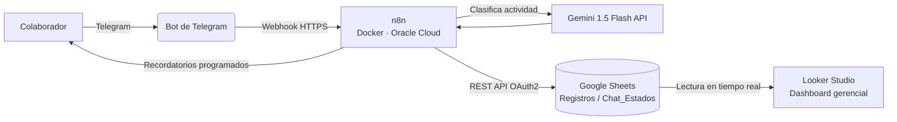
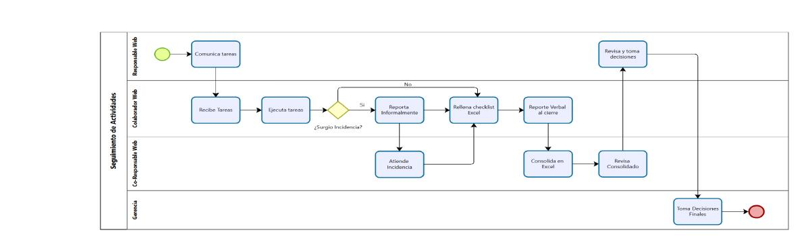
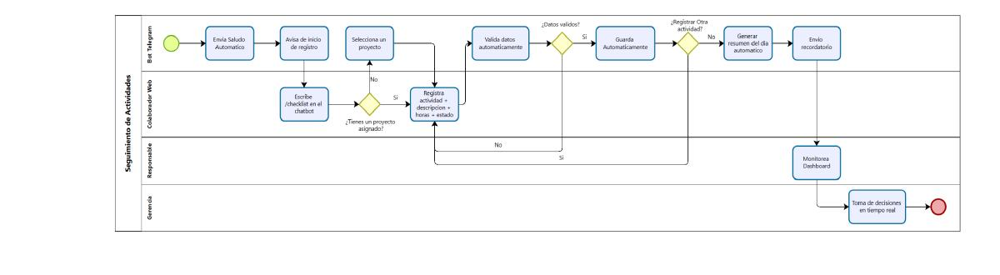
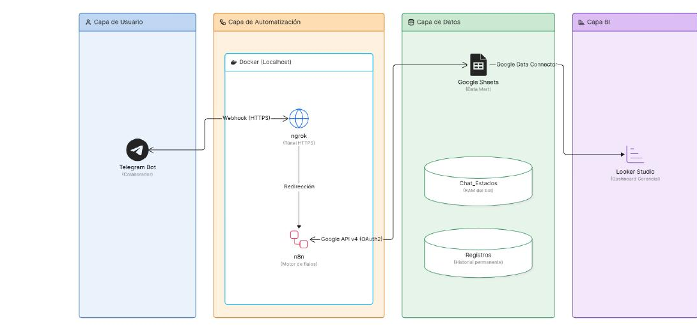
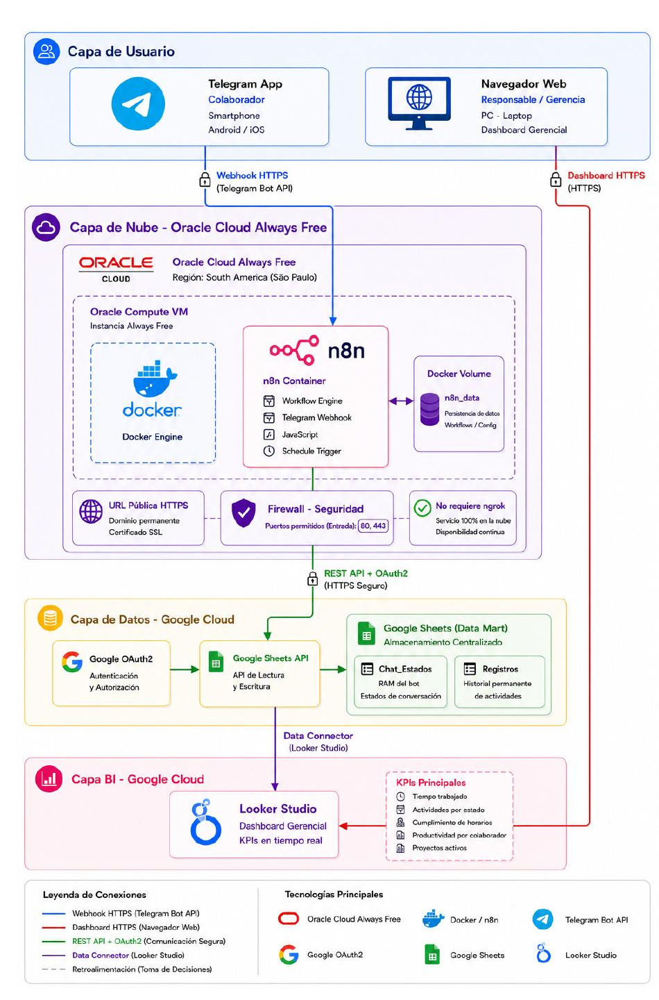
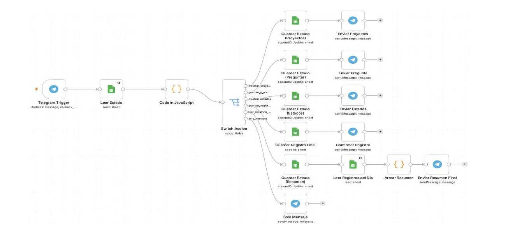
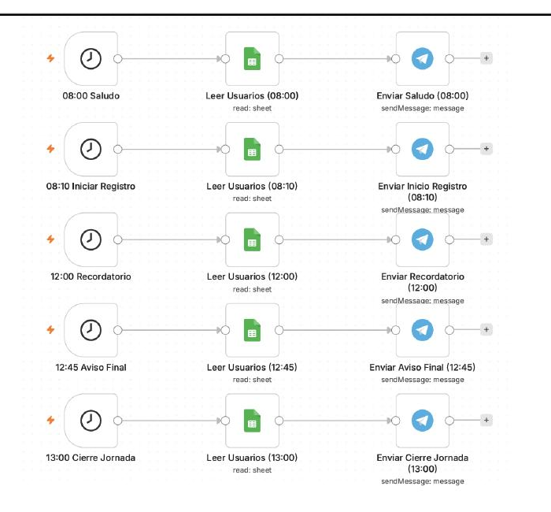
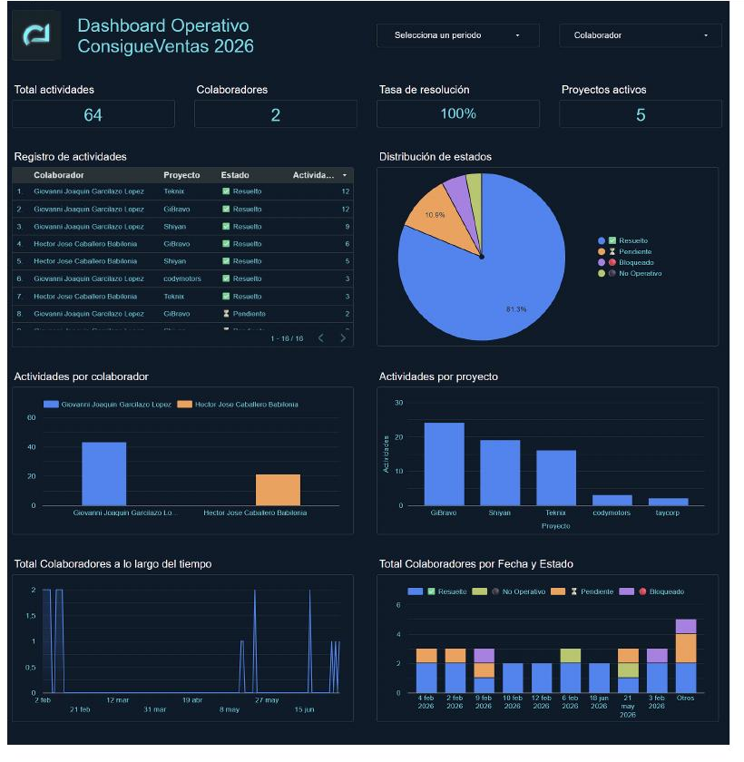

# Sistema de Automatización del Control Operativo con Agentes de IA

**Grupo ConsigueVentas Inversiones E.I.R.L. — Núcleo Web**
Proyecto desarrollado durante las Prácticas Preprofesionales I (PPP1) — Ingeniería de Sistemas, UCV.

## 📌 Descripción

El equipo Núcleo Web registraba sus actividades diarias de forma manual (hojas de cálculo y mensajes de Telegram sin ningún orden), lo que generaba pérdida de tiempo, información dispersa y ninguna trazabilidad para la toma de decisiones.

Este sistema automatiza por completo ese registro: un **bot de Telegram** guía a cada colaborador en un flujo conversacional estructurado, un **agente de IA (Gemini)** clasifica automáticamente cada actividad, y los datos quedan disponibles en tiempo real en un **dashboard gerencial (Looker Studio)** para el responsable del área.

> Este repositorio contiene la **documentación funcional y técnica** del proyecto. La implementación vive como un flujo interno de n8n desplegado en un servidor propio (no aplica publicar el código fuente del workflow, ya que incluye credenciales y configuración específica de la empresa); aquí se documentan la arquitectura, el diseño, los requerimientos y los manuales de uso.

## 🧩 Funcionalidades principales

- Registro de actividades diarias vía bot de Telegram (proyecto, actividad, descripción, hora de inicio/fin, estado)
- Reconocimiento del proyecto asignado durante toda la jornada, sin pedirlo en cada registro
- Validación automática de duración máxima por actividad (60 min)
- Clasificación automática de cada actividad por categoría mediante IA (Gemini 1.5 Flash) y detección automática de incidencias
- Recordatorios automáticos en horarios clave de la jornada laboral
- Resumen automático del día al finalizar la sesión
- Almacenamiento automático en Google Sheets (sin intervención manual)
- Dashboard gerencial en Looker Studio con KPIs filtrables por colaborador, proyecto y fecha (actualización cada 15 min)

## 🏗️ Arquitectura

**Capas del sistema:**
 
| Capa | Componente | Tecnología |
|---|---|---|
| Interfaz conversacional | Bot de Telegram | Telegram Bot API |
| Motor de automatización | Workflow principal (14 nodos) | n8n v2.27.5 sobre Docker |
| Clasificación inteligente | Agente de IA | Gemini 1.5 Flash API (Google AI Studio) |
| Almacenamiento | Data store | Google Sheets (hojas `Registros` y `Chat_Estados`) |
| Visualización | Dashboard gerencial | Looker Studio |
| Infraestructura | Hosting | Oracle Cloud Always Free (Ubuntu 20.04) |
| Exposición segura | Proxy inverso | Nginx + Certbot (SSL) |
| Resolución de dominio | DNS dinámico | DuckDNS |
 
## 🧠 Metodología
 
El proyecto se desarrolló bajo el **Modelo Incremental**, elegido frente a un Modelo Evolutivo porque los requerimientos ya estaban bien definidos desde el análisis inicial del proceso (no era necesario descubrirlos sobre la marcha), y porque el modelo permite entregar en cada incremento un producto parcial funcional, demostrable y validable ante la empresa.
 
El desarrollo se organizó en **6 incrementos**:
 
| Incremento | Entregable | Tecnologías |
|---|---|---|
| INC 1 | Google Sheets estructurado (Data Mart del sistema) | Google Sheets, Google Drive |
| INC 2 | n8n activo en Docker + Bot de Telegram funcional | Docker, ngrok, Telegram Bot API, BotFather |
| INC 3 | Flujo de checklist automatizado end-to-end | n8n, JavaScript, Google Sheets API, Telegram |
| INC 4 | Sistema de recordatorios automáticos | n8n Schedule Trigger, Telegram Bot API |
| INC 5 | Dashboard BI con KPIs en Looker Studio | Looker Studio, Google Sheets |
| INC 6 | Migración a Oracle Cloud, clasificación por IA (Gemini), pruebas y documentación | Oracle Cloud, Docker, Gemini API, Nginx, Certbot, DuckDNS |
 
La arquitectura evolucionó de un despliegue local (Docker + ngrok) hacia un despliegue permanente en la nube (Oracle Cloud Always Free), lo que permitió que el sistema opere de forma continua sin depender del equipo del practicante.
 
## 🖼️ Diagramas y evidencia
 
**Proceso de negocio (AS-IS → TO-BE)**
 
| Antes (manual) | Después (automatizado) |
|---|---|
|  |  |
 
**Arquitectura tecnológica**
 
| Despliegue local (desarrollo) | Despliegue en la nube (producción) |
|---|---|
|  |  |
 
**Workflows de n8n**
 

*Flujo principal (14 nodos): identifica la acción del colaborador y ejecuta la rama correspondiente.*
 

*Flujo de recordatorios automáticos, disparado por horario (Schedule Trigger).*
 
**Dashboard gerencial**
 

*KPIs en tiempo real: total de actividades, tasa de resolución, distribución por estado, actividades por colaborador y por proyecto.*
 
## 📊 Resultados
 
- Bot en producción sobre Oracle Cloud Always Free, procesando registros en tiempo real sin intervención manual, con tiempo de respuesta ~1.2 s (por debajo del umbral de 3 s definido en RNF02)
- Data Mart en Google Sheets (`Registros` + `Chat_Estados`) sin cambios de estructura desde el primer incremento, señal de que los requerimientos se definieron bien desde el inicio
- Tiempo de consolidación de reportes reducido de 3–4 horas a prácticamente tiempo real (objetivo original: bajar a menos de 30 min — ampliamente superado)
- Dashboard gerencial en uso activo por la gerencia; pendiente incorporar al tablero los indicadores de clasificación por IA (`Categoría IA`, `Es Incidencia`), que el sistema ya calcula y almacena
- Validación práctica del Modelo Incremental: desde el INC3 (bot registrando actividad real) ya había valor entregado, sin esperar el sistema completo
**Próximas mejoras identificadas:** extender el sistema a otras áreas del Departamento de Tecnología, completar las visualizaciones de clasificación por IA en el dashboard, y evaluar una versión más avanzada de Gemini para descripciones ambiguas.
 
## 📚 Documentación
 
| Documento | Contenido |
|---|---|
| [`docs/Especificacion_de_Requisitos.docx`](docs/Especificacion_de_Requisitos.docx) | Requerimientos funcionales y no funcionales del sistema |
| [`docs/Casos_de_Uso.docx`](docs/Casos_de_Uso.docx) | Casos de uso detallados (actores, flujos normales y alternos) |
| [`docs/Manual_de_Usuario.docx`](docs/Manual_de_Usuario.docx) | Manual del colaborador (uso del bot) y manual técnico del administrador |

## 🛠️ Stack tecnológico

`n8n` · `Docker` · `Telegram Bot API` · `Gemini 1.5 Flash API (Google AI Studio)` · `Google Sheets API` · `Looker Studio` · `Oracle Cloud Always Free` · `Nginx` · `Certbot` · `DuckDNS`

## 👤 Autor

**Giovanni Joaquín Garcilazo López**
Estudiante de Ingeniería de Sistemas — Universidad César Vallejo
Práctica Preprofesional I — Grupo ConsigueVentas Inversiones E.I.R.L.
